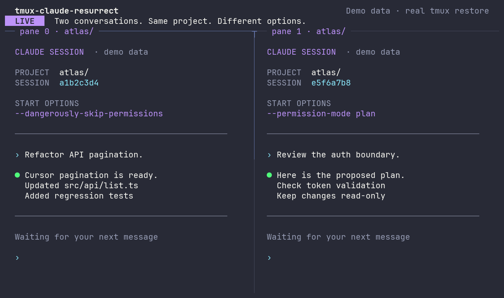

# tmux-claude-resurrect

Resume the **exact Claude Code conversation in each restored tmux pane**.



Real tmux save/restore with synthetic Claude conversations. [Reproduce the demo](demo/README.md).

The plugin reads Claude Code's native session registry, verifies each session against a running process, and saves the mapping and supported launch arguments alongside the tmux-resurrect layout. On restore, it launches `claude --resume <session-id>` with those arguments in the corresponding pane and working directory.

**No Claude hooks, custom logs, background watcher, or npm dependencies.** Node.js is required to run the plugin.

> Claude's native session registry is an internal interface, not a documented API. This plugin validates the format it understands and skips sessions it cannot identify. Run `doctor` before relying on a new Claude Code version.

## Requirements

- macOS or Linux, tmux 3.2 or newer, Bash, and `ps` (the `procps` package on Debian/Ubuntu).
- Node.js 22 or newer, available to the tmux server.
- On macOS, Python 3 available as `python3` in the tmux server's `PATH` (`brew install python`). No Python packages are needed. Linux reads arguments directly from `/proc`.
- [tmux-resurrect](https://github.com/tmux-plugins/tmux-resurrect) and optionally [tmux-continuum](https://github.com/tmux-plugins/tmux-continuum).
- An authenticated Claude Code installation that writes compatible `sessions/<pid>.json` records and persists conversations under its `projects/` directory.

Native registry detection has been checked with Claude Code **2.1.272 on macOS**. Automated integration tests use a synthetic Claude process and real tmux-resurrect on macOS and Linux; they do not establish compatibility with every Claude release. Older releases without this registry, SDK/background sessions, remote processes, and Windows are unsupported.

## Install with TPM

Add the plugin **after tmux-resurrect and before tmux-continuum** in your tmux configuration. Keep TPM initialization last:

```tmux
set -g @plugin 'tmux-plugins/tpm'
set -g @plugin 'tmux-plugins/tmux-resurrect'
set -g @plugin 'dcwigk/tmux-claude-resurrect'
set -g @plugin 'tmux-plugins/tmux-continuum' # Optional

run '~/.tmux/plugins/tpm/tpm'
```

Press `prefix` + `I` to install. The plugin adds no key bindings and makes no changes to Claude's settings.

Inside tmux, check detection while Claude is running in another pane:

```sh
~/.tmux/plugins/tmux-claude-resurrect/bin/claude-resurrect doctor
```

`captured` is the number of unambiguously mapped sessions, or `null` if detection could not complete. Review `unavailable`, `skipped`, and `warnings`. The default TPM directory is shown here; adjust these commands if you use a custom plugin directory.

Save with tmux-resurrect's `prefix` + `Ctrl-s`. After restarting tmux, restore with `prefix` + `Ctrl-r`. Continuum uses the same save/restore integration.

Save at least once with this plugin installed. Old snapshots have no Claude metadata. Avoid adding Claude to `@resurrect-processes`: this plugin supplies the exact resume command for captured sessions.

## What gets restored

| Item | Behavior |
| --- | --- |
| Conversation | Resume by exact session UUID, never by “latest in this directory” |
| Launch arguments | Preserve supported options per session, including explicit permission flags, models, and tool restrictions |
| Working directory | Use the saved directory; skip if it no longer exists |
| Pane address | Match session name, window index, and pane index; live pane IDs may change |
| Running sessions | Skip IDs already present in the verified native registry |
| Existing panes | Preserve them; a bootstrap shell recreated by Resurrect can be used |
| Busy new panes | Wait briefly, then skip if a shell is not idle |
| Missing transcripts | Skip; do not start a replacement conversation |
| Other processes | Leave their snapshot rows to tmux-resurrect |
| Exit from Claude | Return to the configured default shell in the same pane |

This resumes a conversation, not an interrupted operating-system process or a tool call in progress. Arguments are captured automatically from the verified process. For example, a session started with `claude --dangerously-skip-permissions` resumes with that flag; a session started with `--permission-mode plan` keeps that option. Permission bypass is never added to a session that did not request it through its launch arguments.

Initial prompts are not replayed. Old resume/session selectors and worktree-creation flags are replaced by the saved UUID and working directory. Unknown options or unreadable arguments retain the session mapping but prevent its automatic launch, with a reason in `doctor` or `status`. See [argument support and limits](docs/arguments.md).

Per-invocation environment variables and in-session option changes are not reconstructed. Referenced files must still exist, and relative paths resolve from the saved working directory. Claude applies its own configuration and session behavior when it starts. Snapshots can contain sensitive argument values, including inline settings; keep them private.

After upgrading from 0.1.0, save again to capture arguments. Older snapshots still restore using only `--resume <id>`.

## Options

All options are optional. Put them before TPM initialization.

| tmux option | Default |
| --- | --- |
| `@claude-resurrect-command` | `claude` resolved through the tmux process's `PATH` |
| `@claude-resurrect-node` | `node` resolved through `PATH` on each invocation |
| `@claude-resurrect-claude-dir` | `CLAUDE_CONFIG_DIR`, otherwise `~/.claude` |
| `@claude-resurrect-state-dir` | `$XDG_STATE_HOME/tmux/claude-resurrect`, otherwise `~/.local/state/tmux/claude-resurrect` |

`command` and `node` accept one executable name or path, not a shell command with flags. The plugin uses the existing `@resurrect-dir` setting. One Claude profile is supported per tmux server; all cooperating servers should share the same plugin state directory for launch coordination.

```tmux
set -g @claude-resurrect-command '~/.local/bin/claude'
set -g @claude-resurrect-node '/opt/homebrew/bin/node'
```

## Diagnostics and recovery

```sh
~/.tmux/plugins/tmux-claude-resurrect/bin/claude-resurrect status
```

`status` shows the selected snapshot's mappings and recent save/restore reports for the current tmux server as JSON. If the snapshot is missing or damaged, `snapshotError` explains the problem and existing reports remain visible. A reported launch means tmux started the resume command; inspect the pane for authentication errors or errors from Claude itself.

- **No compatible live native session record:** Claude did not provide an identity that matches a live PID and process start time. Check the selected Claude profile and version. No transcript guessing is used.
- **Ambiguous sessions:** multiple eligible processes map to one pane, or the same session ID maps to distinct panes. Split the sessions before saving.
- **Session already running or starting:** a native record or a short-lived launch claim prevents a duplicate. Claims expire after 60 seconds, or earlier when their process exits.
- **Missing directory or transcript:** restore the local project/conversation files first. Snapshots contain metadata, not those files.
- **Cannot read launch claims:** shared startup state is unreadable or malformed. The launch pass stops; inspect the file indicated by `doctor` before repairing it. It is not discarded automatically.
- **Launch failed:** that pane receives a failure record; other eligible panes can still launch.
- **Snapshot changed during restore:** select the desired snapshot and repeat the restore.
- **Restore lock exists:** another restore is running, or one was interrupted. After its owner exits and the lock is at least 30 seconds old, run `bin/claude-resurrect unlock` from the plugin directory. Never remove a live owner's lock.

The plugin only considers panes newly created or recreated during that restore. If a skipped restore left an empty pane, remove that empty pane before retrying, or resume its saved ID manually. Leave restored panes alone until restoration finishes: tmux has no atomic “replace only if still idle” operation.

Each Claude manifest belongs to exactly one Resurrect snapshot. The plugin does not silently substitute an older nonempty manifest. To recover an earlier layout, use [tmux-resurrect's snapshot selection](https://github.com/tmux-plugins/tmux-resurrect/blob/master/docs/restoring_previously_saved_environment.md), then restore normally. Keep the snapshot directory free of whitespace; upstream Resurrect has unquoted path handling. Ordinary project and executable paths with spaces and quotes are tested.

## Remove

Inside tmux, run:

```sh
~/.tmux/plugins/tmux-claude-resurrect/bin/claude-resurrect uninstall
```

Then remove its `@plugin` line and use TPM's uninstall command (`prefix` + `Alt-u`). Uninstall restores previously configured Resurrect hooks when this plugin still owns them. Saved snapshots and diagnostic files remain available; Claude settings were never modified.

## Development

```sh
npm run test:deps
npm run lint
npm test
```

No `npm install` is needed. Development checks require Python 3 on both platforms. Tests use temporary directories, isolated tmux sockets, a synthetic Claude executable, and pinned upstream TPM and tmux-resurrect checkouts. They cover TPM cloning and loading the plugin as well as save/restore. They never authenticate with Claude or use your conversations. `npm run test:unit` runs without tmux or the upstream checkouts.

See [the design and compatibility contract](docs/design.md) for implementation details,
the [changelog](CHANGELOG.md) for releases, and [contributing](CONTRIBUTING.md) for useful bug reports.

## License and acknowledgements

MIT. Built for the extension points provided by [TPM](https://github.com/tmux-plugins/tpm) and tmux-resurrect. This is an independent plugin, not an Anthropic or tmux project.
