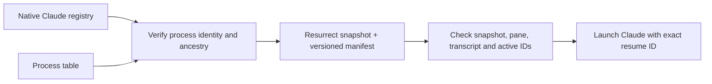

# Design

## Data flow

The plugin is event driven. It does no work while a user is simply typing in tmux. Installation connects three existing Resurrect extension points: `post-save-layout`, `pre-restore-all`, and `post-restore-all`. These are tmux-resurrect hooks; Claude hooks are not used.

## Native registry contract

The supported record is `<claude-dir>/sessions/<pid>.json`. Only these fields are retained in memory:

| Field | Validation/use |
| --- | --- |
| `pid` | Numeric and identical to the filename and a running process |
| `procStart` | Matches `ps` process start time in the C locale and UTC; whitespace normalized |
| `sessionId` | Canonical UUID shape |
| `kind` | Must be `interactive` to capture |
| `entrypoint` | Must be `cli` to capture |
| `cwd` | Absolute, nonempty path without control characters |

Files are limited to 1 MiB. Malformed, stale, or unfamiliar identities are ignored. PID alone is insufficient because the operating system can reuse it. Start times from `ps` have second-level precision; this is an identity check within those limits, not a cryptographic identity.

The process ancestry walk is cycle bounded. A wrapper shell between the pane process and Claude is supported. If Claude launches nested agents, the nearest eligible ancestor to the pane wins. Multiple equally near processes are ambiguous. One ID in multiple captured panes is also ambiguous. Verified IDs of any native session kind block duplicate launches, including a matching process outside tmux.

This interface is internal to Claude Code. There is no assumed minimum Claude version or fallback to transcript timestamps. Unsupported records must remain skipped until the adapter and its tests are updated. Detection does not read conversation contents, credentials, raw command arguments, or private application logs.

## Snapshot ownership

A version-1 JSON manifest occupies one additional tab-delimited `claude-resurrect` row. Each entry contains the logical pane address, UUID, absolute working directory, and transcript path. Resurrect ignores unknown row types.

For a captured pane, the normal saved process command is cleared so upstream process restoration cannot also launch it. Other pane rows are preserved. The manifest is sorted and contains no capture timestamp, allowing Resurrect's unchanged-snapshot deduplication to keep working.

The write happens during `post-save-layout`, before upstream moves its `last` symlink. Snapshot replacement is atomic, in the same directory, with mode `0600`. A saved UUID may remain in a manifest when its project or transcript is temporarily unavailable; the save report explains the problem, and restore still checks both before launching.

Only a single, supported manifest is accepted. Duplicate positions/IDs, control characters, relative paths, unsupported versions, more than 10,000 entries, and snapshots larger than 16 MiB are rejected. The selected snapshot must resolve directly inside the configured Resurrect directory. A transcript must resolve inside the selected profile's `projects/` tree, have the matching UUID filename, and be a nonempty regular file. Its content is never read by this plugin.

Snapshots and reports contain local paths and session IDs. Treat the Resurrect directory as private state. A manifest is not a portable backup of Claude conversations or projects, and these checks do not make an attacker-controlled local snapshot trustworthy.

## Restore lifecycle

1. Before restore, record the snapshot digest, server identity, and existing pane process identities. Protect a sole busy pane from Resurrect's bootstrap overwrite behavior, even if Claude metadata is malformed. Respect an existing user overwrite setting.
2. After upstream restores the layout, clear this plugin's temporary overwrite guard. Require the same snapshot, digest, server, and a pending restore no older than two minutes.
3. Acquire an exclusive lock in the shared state directory. A live owner blocks a second Claude launch pass. An interrupted lock requires explicit recovery, avoiding automatic stale-lock reclamation races.
4. For each entry, locate the logical pane. Existing panes are excluded unless upstream demonstrably replaced an originally idle process. Validate the working directory and transcript again.
5. Wait at most four seconds total for new shells to settle. A candidate must be a recognized shell, outside copy mode, with no child processes. Check live native IDs and startup claims.
6. Recheck pane identity and idleness immediately before `respawn-pane`. Launch an argument-quoted command with only `--resume <UUID>`, set the selected Claude profile, and retain a shell after Claude exits.
7. Record a launch claim containing PID/start identity and write the diagnostic report. Release only a lock still owned by this invocation.

The four-second wait is a shared budget, not four seconds per pane. Process and tmux queries have timeouts. There is no `send-keys` injection, shell-history replay, or permission-bypass flag.

Claims bridge the interval before a new Claude process publishes its native record. They expire after 60 seconds or when their owning process exits. If Claude takes longer to register, duplicate detection is limited by that timeout. Coordination covers servers sharing the same plugin state directory and visible process namespace. It is not a distributed lock across hosts or containers.

Do not run simultaneous upstream restores or type into panes during restore. The plugin serializes its launch pass; it does not lock Resurrect's entire layout transaction. A process could start between the final idle check and tmux's replacement operation. tmux does not provide a compare-and-replace operation that can close that interval.

## Integration ownership

The executable root `.tmux` entry follows [TPM's plugin contract](https://github.com/tmux-plugins/tpm/blob/master/docs/how_to_create_plugin.md). A small shell launcher resolves Node on each call instead of saving a version-manager or Homebrew Cellar path that may disappear after an upgrade.

Installation saves pre-existing Resurrect hook commands and invokes them first, once. Reload is idempotent. A failed prior hook is recorded without preventing this plugin's work; prior hooks have a 30-second timeout. Uninstall restores an earlier command only if this plugin still owns the current hook. Changes made by another plugin are retained.

No Claude settings, terminal colors, pane titles, or key bindings are changed. The runtime uses only Node's standard library and standard system tools.

## Verification scope

Unit tests cover process identity, ancestry ambiguity, internal record/schema rejection, transcript containment, metadata bounds, literal path quoting, atomic state writes, and restore-lock ownership/recovery.

Integration tests run the pinned upstream Resurrect save/restore scripts against isolated real tmux servers. Synthetic processes publish the minimum native registry fields and record their launch arguments. Scenarios include changed pane IDs, multiple sessions in one project, repeated restore, bootstrap replacement, busy-pane protection, missing files, malformed or changed snapshots, an already-running session outside tmux, prior-hook failures, uninstall, and plugin/executable paths with quotes and spaces.

The tests exercise the mechanics without paid Claude calls or real conversation files. Native detection has separately been observed with Claude Code 2.1.272 on macOS. A green test suite cannot promise that a future Claude release retains this undocumented registry.
